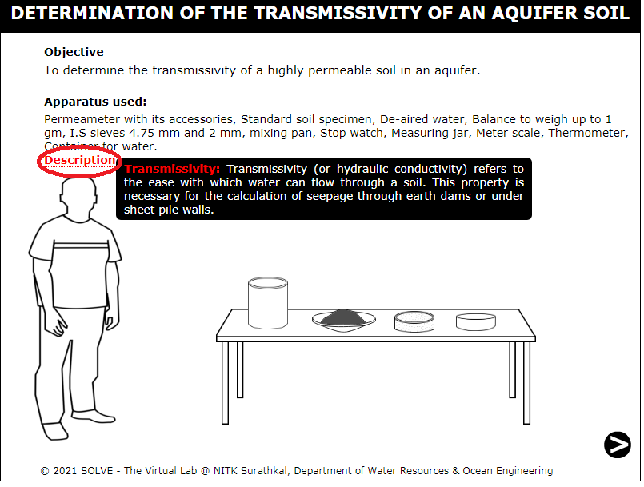
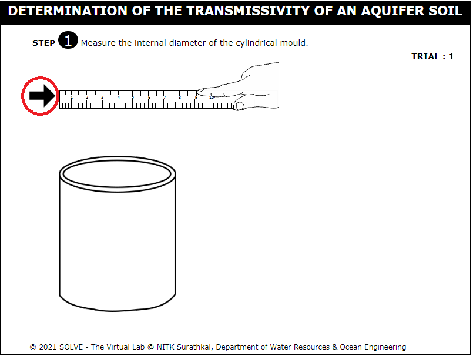
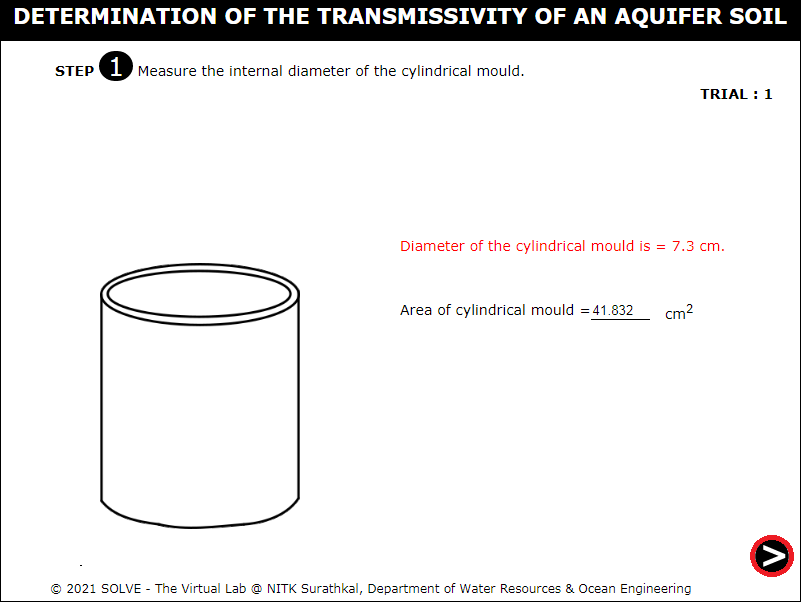
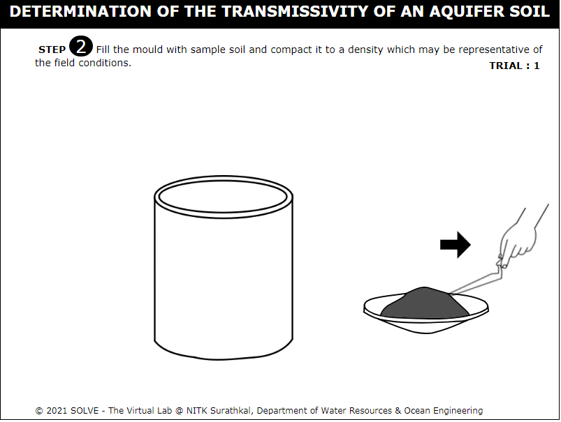
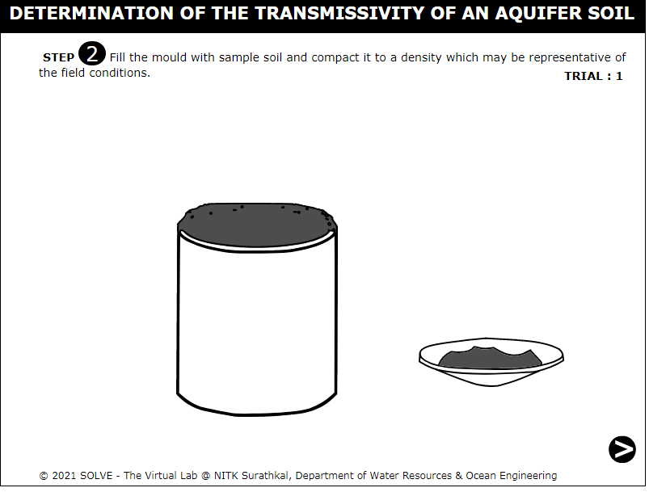
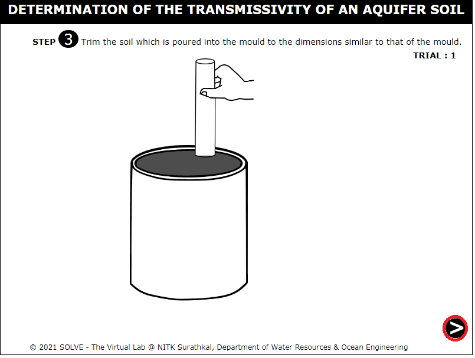
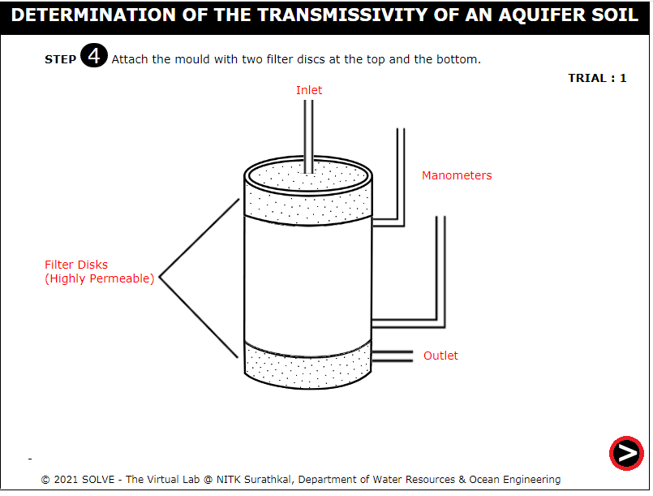

##### These procedure steps will be followed on the simulator

1. When you click on a Transmissivity of an aquifer file, a new window will open as shown below. 
 

2. Click on the scale to measure the internal diameter of the cylindrical mould and click on the next button to prceed further.  
 
 

3. Click on the trowel to fill the mould with the sample soil and click on the NEXT button to proceed further. 
 

4. Attach the mould with the two filter disks and click on the NEXT button to proceed further. 
 

5. Click on the tap to pour the water on the mould and click on the NEXT button to proceed further. 
 

6. Click on the NEXT button at the bottom right corner to proceed to the next step. 
 

7. Result will be displayed as shown below. Repeat the same procedure for trial 2 and tria3. 
 

